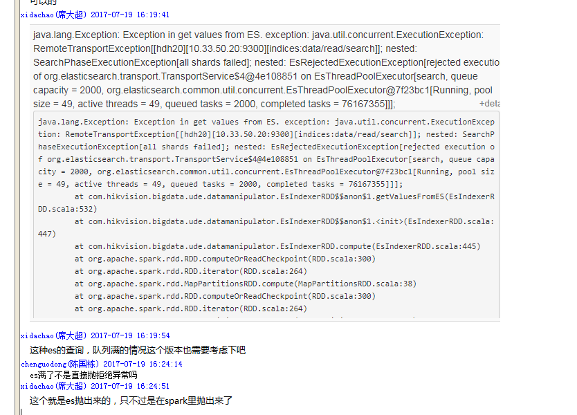

## 关于EsRejectExecutionException异常的分析

异常如下：

原因分析如下：

* ES的每个节点都为检索配置了一个线程池(EsThreadPoolExecutor)和一个等待队列(SizeBlockingQueue)，这个等待队列是一个有界的阻塞队列，也就是说当配置了capacity(这里是2000)后，容量就固定了，当超过这个容量后，就会拒绝后续的请求进入这个队列中。

* 这个线程池有N个workers，这里就是pool size的大小，也就是49个，当一个请求进来时，如果有worker空闲，那么就会起一个worker出来这个请求，如果worker满了，那么进入等待队列中，当请求多时，就会超过这个等待队列，就会抛出EsRejectExecutionException异常。

## 总结

这个异常的原因就是并发请求过多，导致超出了有界的阻塞队列。
解决办法如下：
* 增加这个有界阻塞队列的容量。
* 增加线程池的poo size，
* 这个阻塞队列提供了size方法，可以在请求进来时看这个队列的size是否快接近capacity，如果接近了，就直接拒绝请求。
