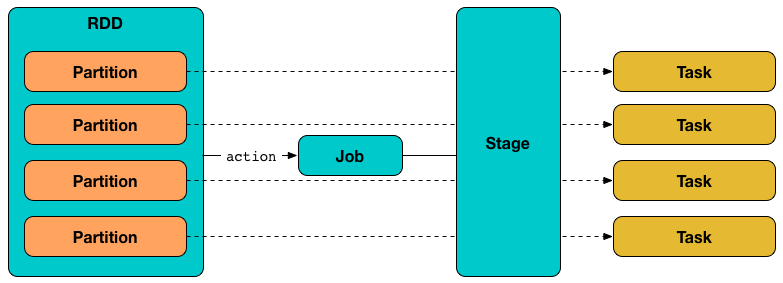
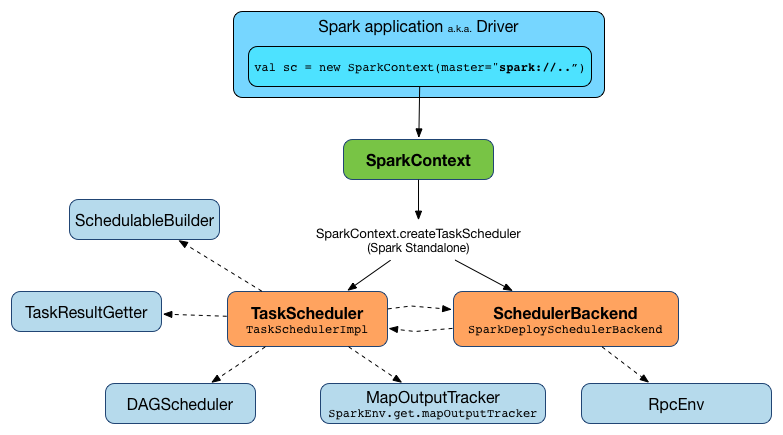

## Spark任务调度

### 任务调度相关的名词解释

#### Speculative Task

在分布式计算环境中，一个job会拆解成多个task，由于各种软硬件异常，某些task运行速度较慢，拖慢了整个job完成时间，对于这些运行速度较慢的task，spark不会尝试诊断或者修复，而是分析出哪些task运行较慢，针对这些较慢的task，启动一些backup的task，称之为speculative task，speculative task会与原有的task一起运行，哪个task首先结束，则使用这个task的结果作为整个job的输出。spark中有四个参数来配置speculative task。
* spark.speculation：是否启用speculative task这个机制。
* spark.speculation.interval：判断是否有speculative task的时间间隔。
* spark.speculation.multiplier：多少次比中值慢的任务就被当成speculative task。
* spark.speculation.quantile：在启动speculative task之前需要完成的task比例。

从另外一个角度考虑就是Job发生了task倾斜，一般task倾斜大部分都是数据倾斜造成的，所以需要看监控界面看是哪一个stage的操作没有完成，然后定位到相关代码。

#### Task

Task是一个Job执行的最小独立单位，其与RDD中的Partition的关系如下图：

Task可以分为两种：
* ShuffleMapTask：把Task的输出根据Task的分区切分成很多的buckets。
* ResultTask：把Task的输出发送到driver端。

### Spark任务调度具体流程

Spark的任务调度可以用下图来描述

TaskScheduler负责任务的提交，并且请求集群管理器对任务调度，也可以看做任务调度的客户端，在SparkCotext中会有初始化。

    // Create and start the scheduler
        val (sched, ts) = SparkContext.createTaskScheduler(this, master, deployMode)
        _schedulerBackend = sched
        _taskScheduler = ts
        _dagScheduler = new DAGScheduler(this)
        _heartbeatReceiver.ask[Boolean](TaskSchedulerIsSet)

如果是跑在local模式，那么初始化流程如下：

    case "local" =>
      val scheduler = new TaskSchedulerImpl(sc, MAX_LOCAL_TASK_FAILURES, isLocal = true)
      val backend = new LocalSchedulerBackend(sc.getConf, scheduler, 1)
      scheduler.initialize(backend)
      (backend, scheduler)

创建TaskSchedulerImpl的构造流程主要有三个：

* 通过SparkConf读取配置信息，主要有
  * 发现预测任务的时间间隔(spark.speculation.interval),默认是100ms。
  * 获取每个任务的CPU数，默认是1。
  * 判断任务是否饥饿的阈值。
  * 获取调度模式，默认是FIFO。

* 创建Pool，这个Pool中的信息主要有：
  * 调度队列(ConcurrentLinkedQueue)。
  * 调度算法(FAIR和FIFO)。
  * 权重。
  * 优先级。
  * 最小份额(minShare)。
  * stage id。

* 初始化TaskResultGetter
  * 通过SparkConf获取resultGetter的线程数。
  * 然后用这个线程数初始化一个线程池，名字是：task-result-getter。
  * 定义一个任务结果的序列化。

创建好TaskScheduler和backend后，需要通过initialize函数初始化TaskSchedulerImpl，通过这个初始化函数可以知道，spark目前支持两种调度模式FIFO和FAIR。任务的实际调度是通过SchedulerBackend实现的，主要有Local、standalone、yarn、mesos。
在初始化过程中，会创建一个SchedulableBuilder，主要作用就是用来创建Pool和TaskSetManager，这个两个都是Schedulable的实体。
