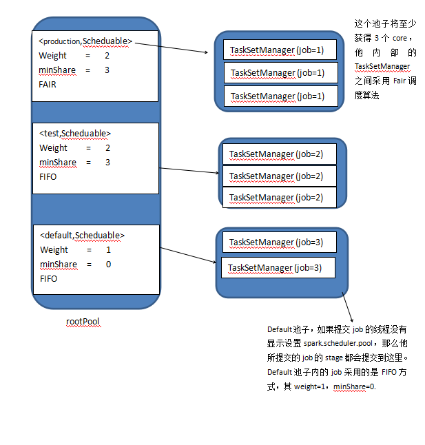

## Spark资源调度-FIFO和fairscheduler

Spark资源调度默认有两个调度算法：FIFO和FAIR，这里分别介绍。

### FIFOSchedulingAlgorithm

    private[spark] class FIFOSchedulingAlgorithm extends SchedulingAlgorithm {
      override def comparator(s1: Schedulable, s2: Schedulable): Boolean = {
        val priority1 = s1.priority
        val priority2 = s2.priority
        var res = math.signum(priority1 - priority2)
        if (res == 0) {
          val stageId1 = s1.stageId
          val stageId2 = s2.stageId
          res = math.signum(stageId1 - stageId2)
        }
        res < 0
      }
    }

代码里有两个重要的属性：priority和stageId，priority其实就是jobid，先提交的jobid越小，因此priority就越小，但是返回的是res是否小于0，也就是说先进来的job先调度。如果优先级一样的情况下，那个就比较stageId，**先调度靠前的stage**， 一般finalStage的stageId最大，parentStage的stageId最小。

对于FIFO

### FairSchedulingAlgorithm

fairscheduler算法可以配置一个fairscheduler.xml的配置文件，假设配置文件如下：

    <?xml version="1.0"?>
    <allocations>
     <pool name="production">
       <schedulingMode>FAIR</schedulingMode>
       <weight>1</weight>
       <minShare>2</minShare>
     </pool>
     <pool name="test">
       <schedulingMode>FIFO</schedulingMode>
       <weight>2</weight>
       <minShare>3</minShare>
     </pool>
    </allocations>

这个配置文件正好对应了Spark中的源码Pool，Pool继承了Schedulable，Schedulable约定了可调度实体的属性，比如说每个可调度的实体需要有以下属性：
* name
* 树状结构的根节点parent(Pool)，也就是父对象，指向了Pool或者TaskSetManager，调度是层级的，是树状的。
* 调度队列(schedulableQueue)：就负责管理的调度对象。
* schedulingMode：FIFO和FAIR。
* weight：权重，指的是和同级相比的权重，权重越大，获取的资源越多。
* minShare：可运行需要的最小资源数，即CPU核数。
* runningTasks
* priority:优先级，指的是在同级别中的优先级，优先级越到的优先调度。
* stageId

那么spark的资源池大概是这样的：

这个资源池里面同样有三个小池子，其名字分别为：production，test，default。一个池子的weight值越大，其获得资源就越多，其中production资源池的weight为2，他将获得更多的资源(与default池子相比)。一个池子的minShare表示这个池子至少获得的core个数，由于其minShare=3,所以他最低将获得3个core，其mode=FAIR，所以提交到这个池子里的job将按照FAIR算法来调度。

具体的FAIR调度代码如下：

    private[spark] class FairSchedulingAlgorithm extends SchedulingAlgorithm {
      override def comparator(s1: Schedulable, s2: Schedulable): Boolean = {
        val minShare1 = s1.minShare
        val minShare2 = s2.minShare
        val runningTasks1 = s1.runningTasks
        val runningTasks2 = s2.runningTasks
        val s1Needy = runningTasks1 < minShare1
        val s2Needy = runningTasks2 < minShare2
        val minShareRatio1 = runningTasks1.toDouble / math.max(minShare1, 1.0)
        val minShareRatio2 = runningTasks2.toDouble / math.max(minShare2, 1.0)
        val taskToWeightRatio1 = runningTasks1.toDouble / s1.weight.toDouble
        val taskToWeightRatio2 = runningTasks2.toDouble / s2.weight.toDouble

        var compare = 0
        if (s1Needy && !s2Needy) {
          return true
        } else if (!s1Needy && s2Needy) {
          return false
        } else if (s1Needy && s2Needy) {
          compare = minShareRatio1.compareTo(minShareRatio2)
        } else {
          compare = taskToWeightRatio1.compareTo(taskToWeightRatio2)
        }
        if (compare < 0) {
          true
        } else if (compare > 0) {
          false
        } else {
          s1.name < s2.name
        }
      }
    }

假定有两个资源池a和b，那么FairSchedulingAlgorithm的算法描述如下：

* 获取s1和s2的minShare。
* 获取这两个调度器中正在运行中的task数，如果是TaskSetManager，那么就是taskSet中运行的task数，如果是Pool，那么就是所有使用这个poolName的所有的TaskSetManager正在运行的task数。
* 如果minShare大于正在运行的task数，那么把Needy设置为true。
* 获取正在运行的task数相对于minShare的比例。
* 获取正在运行的task数相对于Pool的权重的比例
* 如果s1中正在运行的task数小于minShare，也就是最小分配的核数，并且s2中运行的task数大于最小分配核数，那么就返回true。
* 如果正好相反，那么就返回false。
* 如果s1和s2中运行的task数都小于最小分配核数，也就是都可以调度的时候，那么就比较

总结：
* 公平原则本着的原则就是谁最需要就给谁，所以挨饿者优先。
* 资源占用比这块有点费解，如果把他理解成一个贪心问题就容易理解了。对于都是出于挨饿状态的任务可以这样理解，负载大的即时给你资源你也不一定能有效缓解，莫不如给负载小的，让其快速使用，完成后可以释放更多的资源，这是一种贪心策略。如JobA和JobB的Task数量相同都是10，A的minShare是2，B的是5，那占用比为5和2，显然B的占用比更小，贪心的策略应该给B先调度处理。
*
*
