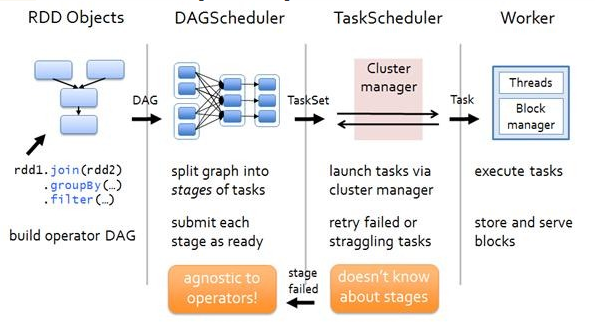
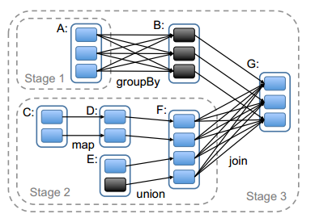

## Spark任务调度-DAGScheduler

Spark Application在遇到Action操作时才会真正的提交任务并进行计算。这时Spark会根据Action操作之前一系列Transform操作的关联关系，生成一个DAG，在后续的操作中，对DAG进行Stage划分，生成Task并最终运行。整个过程如下图所示，DAGScheduler用于对Application进行分析，然后根据各RDD之间的依赖关系划分Stage，根据这些划分好的Stage，对应每个Stage会生成一组Task，将Task Set提交到TaskScheduler后，会由TaskScheduler启动Executor进行任务的计算。如下图所示：

创建代码在SparkContext中。

    // Create and start the scheduler
    val (sched, ts) = SparkContext.createTaskScheduler(this, master, deployMode)
    _schedulerBackend = sched
    _taskScheduler = ts
    _dagScheduler = new DAGScheduler(this)

### 术语解释

* Job：提交给Scheduler的高级工作单元，举例来说，当用户调用一个action操作时，比如count()，就会通过SparkContext.submitJob提交这个任务。每个任务可能会划分为不同的stage，用来构建中间数据。
* Stages: 是一组tasks用来计算job的中间结果，每一个task计算同一个函数的同一个RDD的partition。stage是根据shuffle操作来划分的，这样就引入了一个barrier(我们需要等待前面一个stage完成，用来获取前面stage的输出)。stages分为两种stage：ResultStage和ShuffleMapStage。stages经常在不同的Job之间共享，如果这些Job重复利用相同的RDD。
* Task：是独立的工作单元，每个task都会发送到一个机器上。
* Cache tracking：DAGScheduler指出哪些RDDs需要cache，为了避免重复计算。同样的记住哪些shuffle map stages已经输出文件，为了避免重复做shuffle操作。
* Preferred locations：DAGScheduler会根据RDDs的优先位置信息来运行stage中的每个task。
* Cleanup： 当运行中的Job完成后，它所依赖的数据结构会清空，为了防止在长服务应用中产生内存泄漏。

### DAGScheduler维护的数据结构

DAGScheduler维护的数据结构主要有
* JobId和StageId的关系
* Stage
* ActiveJob
* 缓存的RDD的partitions的位置信息

    //生成JobId
    private[scheduler] val nextJobId = new AtomicInteger(0)

    //总的Job数
    private[scheduler] def numTotalJobs: Int = nextJobId.get()

    //下一个StageId
    private val nextStageId = new AtomicInteger(0)

    //某个Job对应的所有的Stage,key是JobId，value是对应的StageId集合
    private[scheduler] val jobIdToStageIds = new HashMap[Int, HashSet[Int]]

    //StageId对应的Stage
    private[scheduler] val stageIdToStage = new HashMap[Int, Stage]

    //Shuffle对应的ShuffleMapStage
    private[scheduler] val shuffleIdToMapStage = new HashMap[Int, ShuffleMapStage]

    //记录处于Active状态的job，key是JobId，valude是ActiveJob
    private[scheduler] val jobIdToActiveJob = new HashMap[Int, ActiveJob]

    // Stages we need to run whose parents aren't done
    //等待运行的Stage，一般这些是在等待Parent Stage运行完成后才能开始
    private[scheduler] val waitingStages = new HashSet[Stage]

    // Stages we are running right now
    private[scheduler] val runningStages = new HashSet[Stage]

    // Stages that must be resubmitted due to fetch failures
    private[scheduler] val failedStages = new HashSet[Stage]

    //active状态的Job列表
    private[scheduler] val activeJobs = new HashSet[ActiveJob]

    //每一个RDD的Partition的缓存位置，key是RDD的id，value是partition number的数组，
    //每个partition是这个partition的缓存位置的数组。
    private val cacheLocs = new HashMap[Int, IndexedSeq[Seq[TaskLocation]]]

    private val failedEpoch = new HashMap[String, Long]

### Spark Job提交

一个Job是从RDD调用一个Action操作开始的，该Action操作最终会进入org.apache.spark.SparkContext.runJob()或者org.apache.spark.SparkContext.runApproximateJob中，然后调用DAGScheduler.submitJob，这个方法的步骤如下：
* 检查RDD的分区信息。
* 分区信息正常的情况下，构造一个JobId，在同一个SparkContext中，这个JobId就是从0开始的，越早的job的JobId越小，这个后面FIFO调度时就会用到这个JobId。
* 构造一个JobWaiter函数。
* 把这个提交Job的事件加入到eventProcessLoop中，后面会去处理这个事件。

### Spark Stage划分

Stage的划分过程中，涉及到宽依赖和窄依赖，宽依赖是Stage的分界线，其实就是看有没有Shuffle操作。

比如上图中，在RDD G处调用了Action操作，在划分Stage时，会从G开始逆向分析，G依赖于B和F，其中对B是窄依赖，对F是宽依赖，所以F和G不能算在同一个Stage中，即在F和G之间会有一个Stage分界线。上图中还有一处宽依赖在A和B之间，所以这里还会分出一个Stage。最终形成了3个Stage，由于Stage1和Stage2是相互独立的，所以可以并发执行，等Stage1和Stage2准备就绪后，Stage3才能开始执行。
Stage有两个类型，最后的Stage为ResultStage类型，除此之外的Stage都是ShuffleMapStage类型。

DAGScheduler.handleJobSubmitted的源码如下：

    private[scheduler] def handleJobSubmitted(jobId: Int,
          finalRDD: RDD[_],
          func: (TaskContext, Iterator[_]) => _,
          partitions: Array[Int],
          callSite: CallSite,
          listener: JobListener,
          properties: Properties) {
        var finalStage: ResultStage = null
        try {
          // New stage creation may throw an exception if, for example, jobs are run on a
          // HadoopRDD whose underlying HDFS files have been deleted.
          // Stage划分过程是从最后一个Stage开始往前执行的，最后一个Stage的类型是ResultStage
          finalStage = createResultStage(finalRDD, func, partitions, jobId, callSite)
        } catch {
          case e: Exception =>
            logWarning("Creating new stage failed due to exception - job: " + jobId, e)
            listener.jobFailed(e)
            return
        }

        //为该Job生成一个ActiveJob对象，并准备计算这个finalStage
        val job = new ActiveJob(jobId, finalStage, callSite, listener, properties)
        clearCacheLocs()
        logInfo("Got job %s (%s) with %d output partitions".format(
          job.jobId, callSite.shortForm, partitions.length))
        logInfo("Final stage: " + finalStage + " (" + finalStage.name + ")")
        logInfo("Parents of final stage: " + finalStage.parents)
        logInfo("Missing parents: " + getMissingParentStages(finalStage))

        val jobSubmissionTime = clock.getTimeMillis()
        jobIdToActiveJob(jobId) = job
        activeJobs += job
        finalStage.setActiveJob(job)// 该job进入active状态
        val stageIds = jobIdToStageIds(jobId).toArray
        val stageInfos = stageIds.flatMap(id => stageIdToStage.get(id).map(_.latestInfo))
        listenerBus.post(// 向LiveListenerBus发送Job提交事件
          SparkListenerJobStart(job.jobId, jobSubmissionTime, stageInfos, properties))
        submitStage(finalStage)//提交当前Stage
      }
