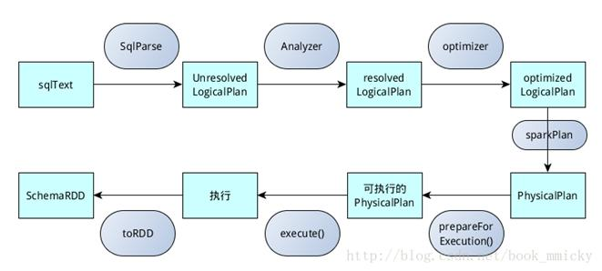

## Spark-SQL

SparkSession是Spark SQL的入口，可以用来操作Dataset和DataFrame的API。

可以通过如下方式创建：

    SparkSession.builder().getOrCreate()

或者：

     SparkSession.builder
        .master("local")
        .appName("Word Count")
        .config("spark.some.config.option", "some-value")
        .getOrCreate()

getOrCreate函数描述如下：

* 获取一个tread-local的SparkSession，如果不为空，并且SparkContext运行中，那么返回这个SparkSession。
* 获取一个root(全局)的SparkSession，如果不为空，并且SparkContext运行中，那么返回这个SparkSession。
* 如果上述都返回false，那么就创建一个新的SparkSession，并且把这个SparkSession设置成全局，创建Spark监听器。

创建SparkSession的代码如下：

    session = new SparkSession(sparkContext, None, None, extensions)

看SparkSession的构造器，有三个主要的属性：

* SharedState
* SessionState
* SparkSessionExtensions

### SharedState

在同一个SQLContext中，SharedState保存了session之间的共享状态，主要有：

* warehousePath： hive数据仓库的路径。
* cacheManager：查询结果缓存。
* listener：SQL监听器。
* externalCatalog：与外部系统交互的catalog。
* globalTempViewManager：全局的临时文件管理器。
* jarClassLoader：用户增加的jar包的加载器。

  SparkSession通过下述方式初始化SharedState：

      @InterfaceStability.Unstable
        @transient
        lazy val sharedState: SharedState = {
          existingSharedState.getOrElse(new SharedState(sparkContext))
        }

### SessionState

对于给定的SparkSession，SessionState保存了这个SparkSession的状态，主要有：

* SharedState： 共享状态。
* SQLConf： SQL配置。
* ExperimentalMethods：？
* FunctionRegistry：？
* UDFRegistration：用户自定义函数注册。
* SessionCatalog：？
* ParserInterface：SQL解析接口。
* Analyzer：对还未分析的逻辑执行计划(LogicalPlan)进行分析。
* Optimizer：对已经分析过的逻辑执行计划进行优化。
* SparkPlanner：将逻辑执行计划转换成物理执行计划(Physical Plan)。
* StreamingQueryManager：？
* ExecutionListenerManager：？
* SessionResourceLoader：资源加载。

SessionState的初始化如下：

    @InterfaceStability.Unstable
      @transient
      lazy val sessionState: SessionState = {
        parentSessionState
          .map(_ .clone(this))
          .getOrElse {
            SparkSession.instantiateSessionState(
              SparkSession.sessionStateClassName(sparkContext.conf),
              self)
          }
      }

主要通过函数BaseSessionStateBuilder来构建SessionState。

### SQL语句执行过程

整体流程如下图：

* 通过Sqlparse 转成unresolvedLogicplan。
* 通过Analyzer转成 resolvedLogicplan。
* 通过optimizer转成 optimzedLogicplan。
* 通过sparkplanner转成physicalLogicplan。
* 通过prepareForExecution 转成executable logicplan。
* 通过toRDD等方法执行executedplan去调用tree的doExecute。

### Catalog

Catalog是一个特质，是与元存储(metastore)交互的接口，比如：数据库，本地表和外部表，自定义函数，表字段，临时的视图等。有一个唯一的实现是 CatalogImpl，初始化在SparkSession中。

    @transient lazy val catalog: Catalog = new CatalogImpl(self)

以requireDatabaseExists为例子说明流程。
* 通过sparkSession.sessionState.catalog获取一个SessionCatalog。
* 调用SessionCatalog中的databaseExists，通过formatDatabaseName格式化下数据库名字。
* 调用externalCatalog.databaseExists(dbName)，这里的externalCatalog有两个实现：InMemoryCatalog和HiveExternalCatalog，在InMemoryCatalog中创建了如下属性：

    private class TableDesc(var table: CatalogTable) {
        val partitions = new mutable.HashMap[TablePartitionSpec, CatalogTablePartition]
      }

      private class DatabaseDesc(var db: CatalogDatabase) {
        val tables = new mutable.HashMap[String, TableDesc]
        val functions = new mutable.HashMap[String, CatalogFunction]
      }

      // Database name -> description
      private val catalog = new scala.collection.mutable.HashMap[String, DatabaseDesc]

### Spark语法树

Spark的语法树是由TreeNode实现的，TreeNode一共有三种：

* UnaryNode：一元节点，即只有一个子节点的节点，如Project、Sort、Limit、Filter等。
* BinaryNode：二元节点，即有左右两个子节点的节点，如Except、Intersect等。
* LeafNode：叶子节点，即没有子节点的节点，如SetCommand、DescribeCommand、ExplainCommand等。

比如现在有一个SQL语句：

    select platediff,plateimagepath from BAYONET_VEHICLEPASS limit 1000

那么Logical Plan是：

    'GlobalLimit 1000
    +- 'LocalLimit 1000
       +- 'Project ['platediff, 'plateimagepath]
          +- 'UnresolvedRelation `BAYONET_VEHICLEPASS`

Analyzed Logical Plan如下：

    platediff: int, plateimagepath: string
    GlobalLimit 1000
    +- LocalLimit 1000
       +- Project [platediff#5290, plateimagepath#5291]
          +- SubqueryAlias BAYONET_VEHICLEPASS, `BAYONET_VEHICLEPASS`
             +- Relation[platediff#5290,plateimagepath#5291,areacode#5292L,area#5293,bigdataplateno#5294,plateprovince#5295,storagetime#5296L,videostructure#5297,sunroofposition#5298,frontconfidence#5299,model#5300,driverposition#5301,veh_pic_url_5#5302,sequenceid#5303L,datasources#5304,vicepilotsunvisor#5305,plateposition#5306,ts#5307L,vehiclesign#5308,vehiclelamp#5309,vehiclehead#5310,vehiclelen#5311,vicedriverposition#5312,pendant#5313,... 49 more fields] HBaseNewScan(BAYONET_VEHICLEPASS,hbp213,BAYONET_VEHICLEPASS,Some(com.hikvision.bigdata.ude.datamanipulator.EsIndexer@7bdd0c8d),hbp213:9300:traffic/vehiclepass)

Optimized Logical Plan如下：

    GlobalLimit 1000
    +- LocalLimit 1000
       +- ExtendedRawTableScan BAYONET_VEHICLEPASS, [platediff#5290, plateimagepath#5291], 1000, true
          +- Relation[platediff#5290,plateimagepath#5291,areacode#5292L,area#5293,bigdataplateno#5294,plateprovince#5295,storagetime#5296L,videostructure#5297,sunroofposition#5298,frontconfidence#5299,model#5300,driverposition#5301,veh_pic_url_5#5302,sequenceid#5303L,datasources#5304,vicepilotsunvisor#5305,plateposition#5306,ts#5307L,vehiclesign#5308,vehiclelamp#5309,vehiclehead#5310,vehiclelen#5311,vicedriverposition#5312,pendant#5313,... 49 more fields] HBaseNewScan(BAYONET_VEHICLEPASS,hbp213,BAYONET_VEHICLEPASS,Some(com.hikvision.bigdata.ude.datamanipulator.EsIndexer@7bdd0c8d),hbp213:9300:traffic/vehiclepass)

Physical Plan如下：

    CollectLimit 1000
    +- *Project [platediff#5290, plateimagepath#5291]
       +- *Scan HBaseNewScan(BAYONET_VEHICLEPASS,hbp213,BAYONET_VEHICLEPASS,Some(com.hikvision.bigdata.ude.datamanipulator.EsIndexer@7bdd0c8d),hbp213:9300:traffic/vehiclepass) [platediff#5290,plateimagepath#5291]
