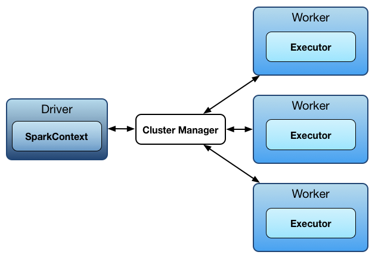
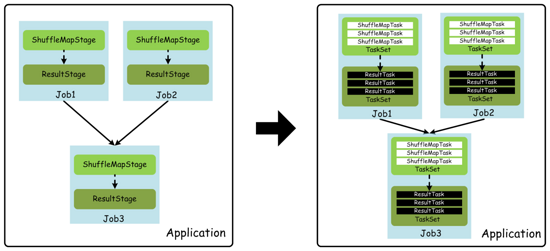
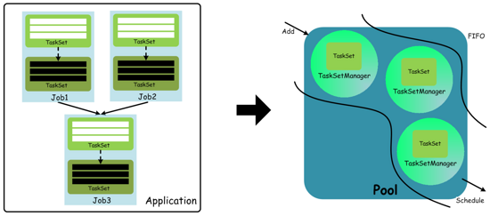
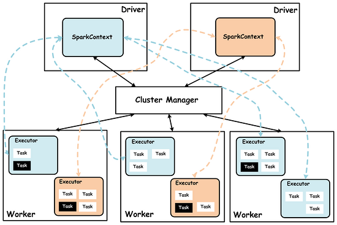
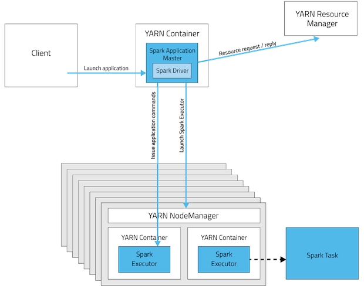
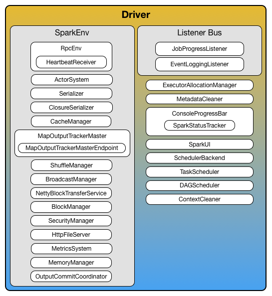
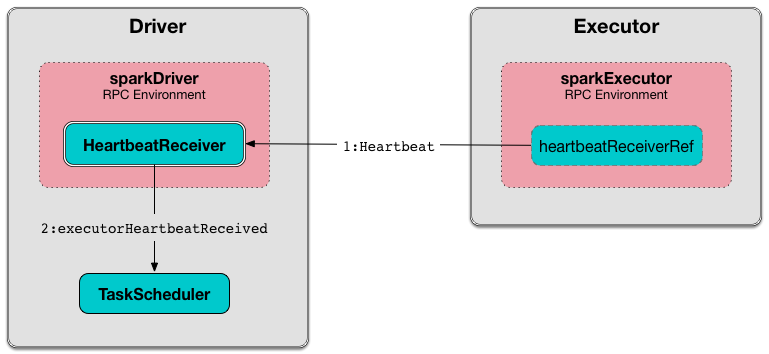

## spark基础

### spark模块

spark主要由以下模块组成：

* Spark Core：Spark的核心功能实现，包括：SparkContext的初始化(DriverApplication通过SparkContext提交)、部署模式、存储体系、任务提交与执行、计算引擎等。
* Spark SQL：提供SQL处理能力，便于熟悉关系型数据库操作的工程师进行交互查询。此外，还为熟悉Hadoop的用户提供Hive SQL处理能力。
* Spark Streaming：提供流式计算处理能力，目前支持Kafka、Flume、Twitter、MQTT、ZeroMQ、Kinesis和简单的TCP套接字等数据源。此外，还提供窗口操作。
* GraphX：提供图计算处理能力，支持分布式， Pregel提供的API可以解决图计算中的常见问题。
* MLlib：提供机器学习相关的统计、分类、回归等领域的多种算法实现。其一致的API接口大大降低了用户的学习成本。
各个模块的关系如下图：

### spark架构

Spark是一个master/Worker的架构，driver和master通信，master管理work，work运行exector。driver和Executors是独立的java进程，可以一起运行，也可以在不同的机器上运行。如下图所示：

### 基本概念

* Application: 使用者编写的spark程序，由驱动程序和executor组成。
* Driver 运行main方法和创建SparkContext上下文。
* Cluster manager：(yarn、mesos、standalone)负责外部应用的资源分配，又称之为master。
* Deploy mode：区别cluster模式，client提交驱动任务在集群外部，而cluster提交驱动程序在集群内部，具体细节在下一节解释。
* Worker node：在整个集群运行任务的节点。
* Executor：在一个work node上启动一个进程，运行任务，保存数据在内存或者磁盘上，每个应用有它自己的一系列executors。
* Task： 一个工作单元，轻量级线程模式运行在进行Executor里面。是在物理节点上运行的基本单位，Task包含两类：ShuffleMapTask和ResultTask，分别对应于Stage中ShuffleMapStage和ResultStage中的一个执行基本单元。
* Job：一个并行的计算过程，由多个task组成，并且执行一些action等待spark响应。用户程序中，每次调用Action时，逻辑上会生成一个Job，一个Job包含了多个Stage。
* stage：每个job划分为过个小的task称之为stage，他们之间相互依赖。Stage包括两类：ShuffleMapStage和ResultStage，如果用户程序中调用了需要进行Shuffle计算的Operator，如groupByKey等，就会以Shuffle为边界分成ShuffleMapStage和ResultStage。
* TaskSet: 基于Stage可以直接映射为TaskSet，一个TaskSet封装了一次需要运算的、具有相同处理逻辑的Task，这些Task可以并行计算，粗粒度的调度是以TaskSet为单位的。
* NarrowDependency：窄依赖。即子RDD依赖于父RDD中固定的Partition。NarrowDependency分为OneToOneDependency和RangeDependency两种。
* ShuffleDependency：shuffle依赖，也称为宽依赖。即子RDD对父RDD中的所有Partition都有依赖。
* DAG（Directed Acycle graph）：有向无环图。用于反映各RDD之间的依赖关系。

这些概念可以用下面的图描述：

上图中，每个job只有一次shuffle处理，所以对应两个stage。

#### standalone模式

在standalone模式下，默认采用FIFO这种简单的调度策略，在进行调度的过程中，大概流程如下：

从用户提交spark程序，最终生成TaskSet，而在调度时，通过TaskSetManager来管理一个TaskSet(包含一组可在物理节点上执行的Task)，这里面TaskSet必须按照顺序执行才能保证计算结果的正确性，因为TaskSet之间是有序依赖的(上溯到ShuffleMapStage和ResultStage)，只有一个TaskSet中的所有Task都运行完成后，才能调度下一个TaskSet中的Task去执行。

#### 集群模式

Spark集群在设计的时候，并没有在资源管理的设计上对外封闭，而是充分考虑了未来对接一些更强大的资源管理系统，如YARN、Mesos等，所以Spark架构设计将资源管理单独抽象出一层，通过这种抽象能够构建一种适合企业当前技术栈的插件式资源管理模块，从而为不同的计算场景提供不同的资源分配与调度策略。Spark集群模式架构，如下图所示：

上图中，spark集群Cluster Manager目前支持如下三种模式：

* standalone模式
Standalone模式是Spark内部默认实现的一种集群管理模式，这种模式是通过集群中的Master来统一管理资源，而与Master进行资源请求协商的是Driver内部的StandaloneSchedulerBackend（实际上是其内部的StandaloneAppClient真正与Master通信），后面会详细说明。

* YARN模式
YARN模式下，可以将资源的管理统一交给YARN集群的ResourceManager去管理，选择这种模式，可以更大限度的适应企业内部已有的技术栈，如果企业内部已经在使用Hadoop技术构建大数据处理平台。

* Mesos模式
Spark构建在Mesos之上，能够支持细粒度、粗粒度的资源调度策略。

### yarn-cluster和yarn-client的区别

spark支持的三种集群模式，都由两个组件组成：master和slave。master服务(yarn resourcemanager,mesos master和spark standalone master)决定哪些apllication可以运行，什么时候运行，哪里运行。slave服务(yarn nodemanager,mesos slave,spark standalone slave)实际运行executor进程。

yarn-cluster和yarn-client模式的区别其实就是Application master进程的区别，yarn-cluster模式下，driver运行在AM中，它负责向yarn申请资源，并监督作业的运行状况。当用户提交了作业之后，就可以关掉client，作业会继续在yarn上运行，所以yarn-cluster模式不适合运行交互类型的作业。如下图所示：

而yarn-client模式下，AM仅仅向yarn请求executor，client会和请求的container通信来调度他们工作，也就是说client不能退出。如下图所示：

### Driver

spark的driver是一个JVM进程，用来创建Spark应用的SparkContext，跑在spark集群的master节点上。driver会有很多的服务，具体如下，**注意** 现在spark2.0已经改了，到时再修改下：

driver把应用程序分解成task，并且通过taskscheduler调度task跑在executors上。同时协调workers和tasks的执行。

### Executor

Executor是一个分布式的agent，负责执行tasks。Executor的创建有一下几种情形。

* 在spark standalone和yarn模式下，CoarseGrainedExecutorBackend接收到RegisteredExecutor的消息。
* 在mesos模式下，MesosExecutorBackend执行了registered。
* local模式下创建了LocalEndpoint。

Executor随着spark的应用程序存活而存活，称之为static allocation of executors(静态executors分配)。
Executor向driver报告运行中的task的心跳和一些度量值。如下所示：

## Spark 任务调度
