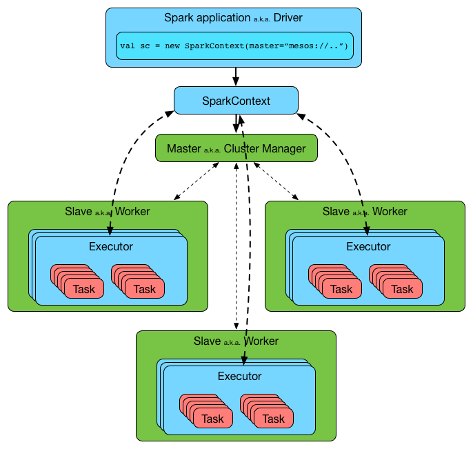

### spark架构

Spark是一个master/Worker的架构，driver和master通信，master管理work，work运行exector。如下图所示：

driver和Executors是独立的java进程，可以一起运行，也可以在不同的机器上运行，具体如下图所示：

### 基本概念

* Application: 使用者编写的spark程序，由驱动程序和executor组成。
* Driver 运行main方法和创建SparkContext上下文。
* Cluster manager：(yarn、mesos、standalone)负责外部应用的资源分配，又称之为master。
* Deploy mode：区别cluster模式，client提交驱动任务在集群外部，而cluster提交驱动程序在集群内部，具体细节在下一节解释。
* Worker node：在整个集群运行任务的节点。
* Executor：在一个work node上启动一个进程，运行任务，保存数据在内存或者磁盘上，每个应用有它自己的一系列executors。
* Task： 一个工作单元，轻量级线程模式运行在进行Executor里面。是在物理节点上运行的基本单位，Task包含两类：ShuffleMapTask和ResultTask，分别对应于Stage中ShuffleMapStage和ResultStage中的一个执行基本单元。
* Job：一个并行的计算过程，由多个task组成，并且执行一些action等待spark响应。用户程序中，每次调用Action时，逻辑上会生成一个Job，一个Job包含了多个Stage。
* stage：每个job划分为过个小的task称之为stage，他们之间相互依赖。Stage包括两类：ShuffleMapStage和ResultStage，如果用户程序中调用了需要进行Shuffle计算的Operator，如groupByKey等，就会以Shuffle为边界分成ShuffleMapStage和ResultStage。
* TaskSet: 基于Stage可以直接映射为TaskSet，一个TaskSet封装了一次需要运算的、具有相同处理逻辑的Task，这些Task可以并行计算，粗粒度的调度是以TaskSet为单位的。

这些概念可以用下面的图描述：

上图中，每个job只有一次shuffle处理，所以对应两个stage，在standalone模式下，默认采用FIFO这种简单的调度策略，在进行调度的过程中，大概流程如下：

### yarn-cluster和yarn-client的区别

spark支持的三种集群模式，都由两个组件组成：master和slave。master服务(yarn resourcemanager,mesos master和spark standalone master)决定哪些apllication可以运行，什么时候运行，哪里运行。slave服务(yarn nodemanager,mesos slave,spark standalone slave)实际运行executor进程。

yarn-cluster和yarn-client模式的区别其实就是Application master进程的区别，yarn-cluster模式下，driver运行在AM中，它负责向yarn申请资源，并监督作业的运行状况。当用户提交了作业之后，就可以关掉client，作业会继续在yarn上运行，所以yarn-cluster模式不适合运行交互类型的作业。如下图所示：

而yarn-client模式下，AM仅仅向yarn请求executor，client会和请求的container通信来调度他们工作，也就是说client不能退出。如下图所示：

### Driver

spark的driver是一个JVM进程，用来创建Spark应用的SparkContext，跑在spark集群的master节点上。driver会有很多的服务，具体如下，**注意** 现在spark2.0已经改了，到时再修改下：

driver把应用程序分解成task，并且通过taskscheduler调度task跑在executors上。同时协调workers和tasks的执行。

### Executor

Executor是一个分布式的agent，负责执行tasks。Executor的创建有一下几种情形。

* 在spark standalone和yarn模式下，CoarseGrainedExecutorBackend接收到RegisteredExecutor的消息。
* 在mesos模式下，MesosExecutorBackend执行了registered。
* local模式下创建了LocalEndpoint。

Executor随着spark的应用程序存活而存活，称之为static allocation of executors(静态executors分配)。
Executor向driver报告运行中的task的心跳和一些度量值。如下所示：

