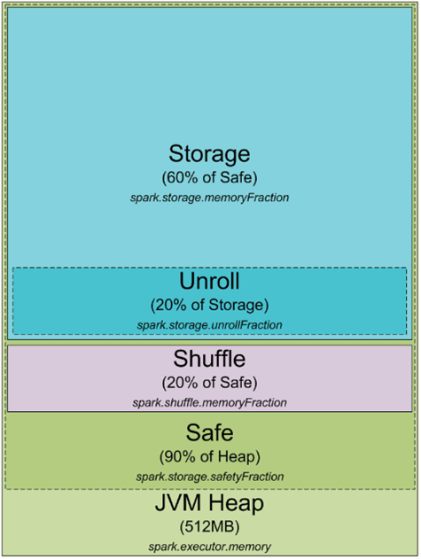
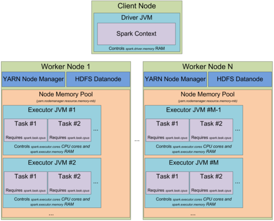

翻译自：

## spark内存分配

在cluster或者local machine上正常运行的任何spark程序都是一个JVM进程。对于任何的JVM进程，都可以用-Xmx和-Xms配置它的堆大小(heap size)，问题是：这些进程是如何使用它的堆内存(heap memory)。首先看一下spark的JVM内存分配图。

### Heap size

默认情况下，Spark启动时会初始化512M的JVM内存。出于安全角度，并且为了避免OOM错误，Spark只允许使用90%的堆内存，该参数可以通过Spark的 **spark.storage.safetyFraction** 参数进行控制。Spark允许将数据放在缓存中，但不是真正的基于内存的，仅仅是在LRU cache过程中使用内存(参考：[Spark Misconceptions](https://0x0fff.com/spark-misconceptions/))。所以一部分的内存用于数据缓存，这部分通常占安全内存(90%)的60%，该参数可以通过配置**spark.storage.memoryFraction**进行控制。所以如果想知道Spark中可以缓存多少数据，那么可以通过对所有的executor的堆大小求和，然后乘以**safetyFraction**和**storage.memoryFraction**即可，默认情况下是0.9 * 0.6 = 0.54,即总的堆内存的54%可供Spark使用。

### Shuffle Memory

Shuffle memroy的计算公式是：**Heap Size** * **spark.shuffle.safetyFraction** * **spark.shuffle.memoryFraction**。**spark.shuffle.safetyFraction** 的默认值是 0.8 或80%， **spark.shuffle.memoryFraction** 的默认值是0.2或20%，所以你最后可以用于shuffle的JVM heap 内存大小是 0.8*0.2=0.16 ，即总heap size的 16% 。总得来说，Spark将这部分memory 用于Shuffle阶段调用其他的具体task。当shuffle执行之后，有时你需要对数据进行sort。在sort阶段，通常你还需要一个类似缓冲的buffer来存储已经排序好的数据（谨记，不能修改已经LRU cache中的数据，因为这些数据可能会再次使用）。因此，需要一定数量的RAM来存储已经sorted的数据块。如果你没有足够的memory用来排序，那么就需要 **external sorting** 外排序。外排序允许你对块对数据块进行分类，然后将最后的结果合并到一起。

### unroll Memory

关于RAM最后要讲到 **unroll memory**，用于unroll进程的内存总量计算公式为： **spark.storage.unrollFraction** * **spark.storage.memoryFraction** * **spark.storage.safetyFraction** 。默认情况下是 0.2 * 0.6 * 0.9 = 0.108 ,即 10.8% 的heap size。 当你需要在内存中将数据块展开的时候使用它。为什么需要 unroll 操作呢？在Spark中，允许以 序列化（serialized ）和反序列化（deserialized） 两种方式存储数据，而对于序列化后的数据是无法直接使用的，所以在使用时必须对其进行unroll操作，因此这部分RAM是用于unrolling操作的内存。unroll memory 与storage RAM 是共享的，也就是当你在对数据执行unroll操作时，如果需要内存，而这个时候内存却不够，那么可能会致使撤销存储在 Spark LRU cache中少些数据块。

### Spark 集群模式JVM分配

OK，通过上面的讲解，我们应该对Spark进程有了进一步的理解，并且已经知道它是如何利用JVM进程中的内存。现在切换到集群上，以YARN模式为例。

在YARN集群里，它有一个YARN ResourceMananger 守护进程控制着集群资源（也就是memory），还有一系列运行在集群各个节点的YARN Node Managers控制着节点资源的使用。从YARN的角度来看，每个节点可以看做是可分配的RAM池，当你向ResourceManager发送request请求资源时，它会返回一些NodeManager信息，这些NodeManager将会为你提供execution container，而每个execution container 都是一个你发送请求时指定的heap size的JVM进程。JVM的位置是由 YARN ResourceMananger 管理的，你没有控制权限。如果某个节点有64GB的RAM被YARN控制着（可通过设置 yarn-site.xml 配置文件中参数 yarn.nodemanager.resource.memory-mb )，当你请求10个4G内存的executors时，这些executors可能运行在同一个节点上，即便你的集群跟大也无济于事。

当以YARN模式启动spark集群时，你可以指定executors的数量（ -num-executors 或者 spark.executor.instances 参数)，可以指定每个executor 固有的内存大小（ -executor-memory 或者 spark.executor.memory )，可以指定每个executor使用的cpu核数（ -executor-cores 或者 spark.executor.cores )，可以指定分配给每个task的core的数量（ spark.task.cpus )，还可以指定 driver 上使用的内存（ -driver-memory 或者 spark.driver.memory )。

当你在集群上执行应用程序时，job程序会被切分成多个stages，每个stage又会被切分成多个task，每个task单独调度，可以把每个executor的JVM进程看做是task执行槽池，每个executor 会给你的task设置 spark.executor.cores/ spark.task.cpus execution 个执行槽。例如，在集群的YARN NodeManager中运行有12个节点，每个节点有64G内存和32个CPU核（16个超线程物理core）。每个节点可以启动2个26G内存的executor（剩下的RAM用于系统程序、YARN NM 和DataNode），每个executor有12个cpu核可以用于执行task（剩下的用于系统程序、YARN NM 和DataNode），这样整个集群可以处理 12 machines * 2 executors per machine * 12 cores per executor / 1 core = 288 个task 执行槽，这意味着你的spark集群可以同时跑288个task，几乎充分利用了所有的资源。整个集群用于缓存数据的内存有 0.9 spark.storage.safetyFraction * 0.6 spark.storage.memoryFraction * 12 machines * 2 executors per machine * 26 GB per executor = 336.96 GB . 实际上没有那么多，但在大多数情况下，已经足够了。

到这里，大概已经了解了spark是如何使用JVM的内存，并且知道什么是集群的执行槽。而关于task，它是Spark执行的工作单元，并且作为exector JVM 进程中的一个thread执行。这也是为什么Spark job启动时间快的原因，在JVM中启动一个线程比启动一个单独的JVM进程块，而在Hadoop中执行MapReduce应用会启动多个JVM进程。

### Spark Partition

下面来谈谈Spark的另一个抽象概念”partition”。在Spark程序运行过程中，所有的数据都会被切分成多个Partion。问题是一个parition是什么并且如何决定partition的数量呢？首先Partition的大小完全依赖于你的数据源。在Spark中，大部分用于读取数据的method都可以指定生成的RDD中Partition数量。当你从hdfs上读取一个文件时，你会使用Hadoop的InputFormat来指定，默认情况下InputFormat返回每个InputSplit都会映射到RDD中的一个Partition上。对于HDFS上的大部分文件，每个数据块都会生成一个InputSplit，大小近似为64 MB/128 MB的数据。近似情况下，HDFS上数据的块边界是按字节来算的（64MB一个块），但是当数据被处理时，它会按记录进行切分。对于文本文件来说切分的字符就是换行符，对于sequence文件，它以块结束等等。比较特殊的是压缩文件，由于整个文件被压缩了，因此不能按行进行切分了，整个文件只有一个inputsplit，这样spark中也会只有一个parition，在处理的时候需要手动对它进行repatition。
