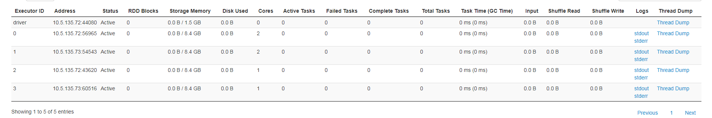

### Worker异常退出

* Executor会调用shutdownHook，继而调用killProcess函数，这里会把进程的退出状态码exitCode作为ExecutorStateChanged的一部分发送给worker。

* 但是由于worker异常退出了，所以不会有HeartBeat消息发送给Master，但是Master会定时调用CheckForWorkerTimeOut检查worker的时间戳。

* 那么就发现worker无法更新Master最后接收到的心跳的时间戳，那么Master就会调用removeWorker删除长期失联的worker的workInfo信息，并且将此worker的所有的Executor以LOST状态同步更新到Driver application，并且重新调度分配到其他的worker上。

* 重新调度的时候调用Master的schedule函数，这里会调用startExecutorsOnWorkers简单描述为：1、根据worker的剩余内存和剩余核数选择出可用的worker，如下图，worker-20171129152641-10.33.36.130-38966可用内存10G，可用核数24个，worker-20171129152641-10.5.135.56-37549可用内存10G，可用核数24个，UDE的启动参数是：--driver-memory 5g --executor-memory 10g --total-executor-cores 12。所以这两个都是可用worker

* 然后不断循环遍历这两个worker，每次分配一个核，直到分配完全，也就是说核的最小分配粒度是1个，这样分配后如下所示：

### Master异常退出

* Master退出后会进行选举，当选举出新的Master后，就需要恢复之前的信息，主要有：storedApps、storedDrivers、storedWorkers

* 在恢复的时候就会注册新worker信息，并删除以前的worker信息，并重新调度，那么重复上面的调度流程。

### 结论

总结：只要是ude的driver挂掉，那么就不会出现分裂，否则就会出现分裂。

* 所以如果worker异常退出，并且不是UDE的driver，那么就会出现分裂，如下所示：

* 所以如果worker异常退出，并且是UDE的driver，那么就不会出现分裂，如下所示：

* 如果是master异常退出，并且是UDE的dirver，那么就不会出现分裂，如下所示：

* 如果是master异常退出，并且不是UDE的dirver，那么就会出现分裂，如下所示：

### 可改进方法

* 加这个参数能解决问题， --executor-cores 4

* 修改Spark调度的代码，比如按worker的可用资源排序，并且设定一个资源分配的粒度，比如4，那么举例说明如下：比如有3个worker1、2、3，可用资源分别是8、7、6，需要分配的资源是3，那么就直接在1号worker上起1个Executor就可以了。现有的方案是1、2、3号worker分别起1个Executor，每个Executor1个核。
