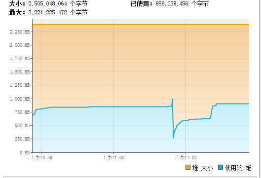
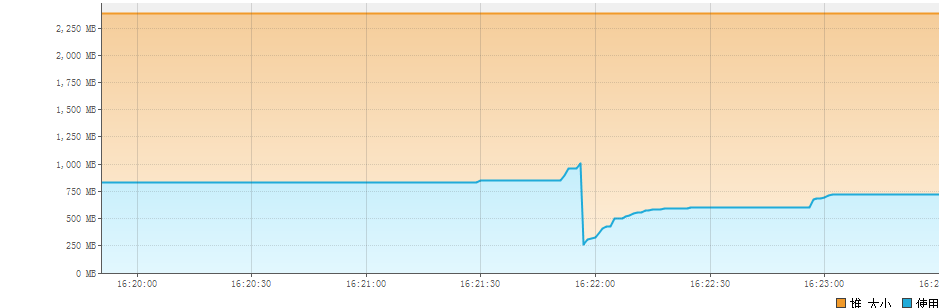

稳定状态下，使用堆大小都是750M。

### INCREMENTALCOLLECT是false,也就是数据会拉到driver端

* 当limit是10000时，跑1次，堆最高使用了900M，最低使用了250M，平均使用了600M。

* 任务的平均执行时间是：3s。

### INCREMENTALCOLLECT是true，也就是数据不会拉到driver端

* 当limit是10000时，跑1次，堆使用最大600M，最小250M，平均使用4000M。

* 任务的平均执行时间是1分钟。

### 结论

* toLocalIterator会降低性能，但是会减少driver端的内存消耗。
