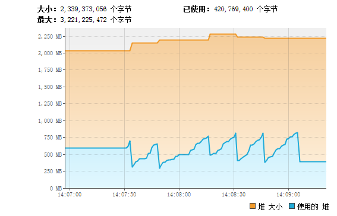
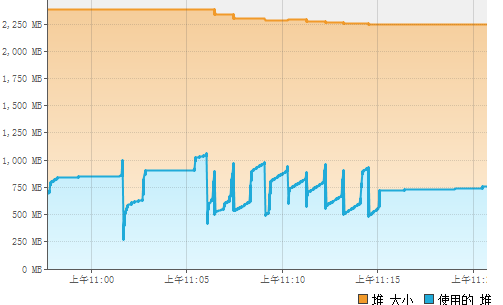
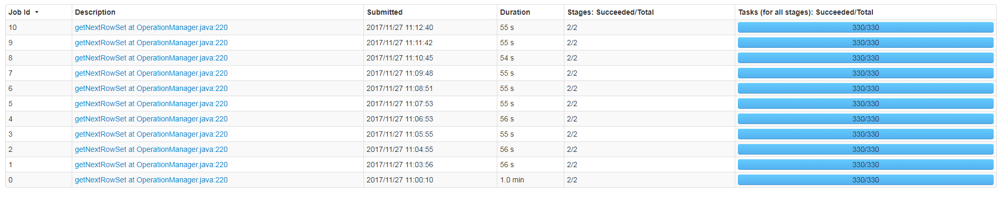

稳定状态下，使用堆大小INCREMENTALCOLLECT是false是415M,INCREMENTALCOLLECT是true是750M。

### INCREMENTALCOLLECT是false,也就是数据会拉到driver端

* 当limit是1000时，跑10次，堆最高使用了750M，最低使用了450M，平均使用了600M。

* 任务的平均执行时间是：3s。

### INCREMENTALCOLLECT是true，也就是数据不会拉到driver端

* 当limit是1000时，跑10次，堆使用最大1100M，最小500M，平均使用750M。

* 任务的平均执行时间是1分钟。

