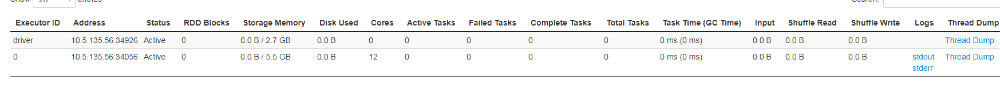
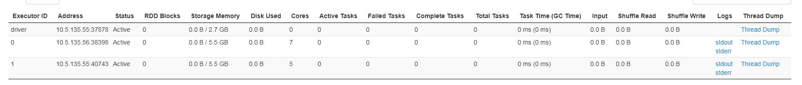

## ude启动脚本如下：

 /usr/lib/cluster001/SERVICE-UDE-3963f4af34ac4d838a245a310b17c3e5/sbin/start.sh 10007 --driver-memory 5g --executor-memory 10g --total-executor-cores 12 --master  spark://node56:7078,node55:7078  --properties-file=/etc/cluster001/SERVICE-UDE-3963f4af34ac4d838a245a310b17c3e5/ude.conf

### 如果断电driver端服务器

* 一开始是起了一个executor，这个executor一共有12个core。过了一会，这个executor也下线了，ude和spark Streaming都下线不可用。

重启后，ude分配了一个executor，12core。

### 如果断电不是driver端服务器

* ude和spark Streaming都出现分裂，并不是只有ude分裂。如下图所示：

*

### 结论

* 根据现象得出的结论是：spark standalone模式下cpu资源和内存资源分配不可控，已分配好的不会重新分配，未分配的资源也不会均分，比较随机，但是核心不会超过配置的total-executor-cores,在这个前提下去启动executor，并且保证分配的内存小于可用内存。
