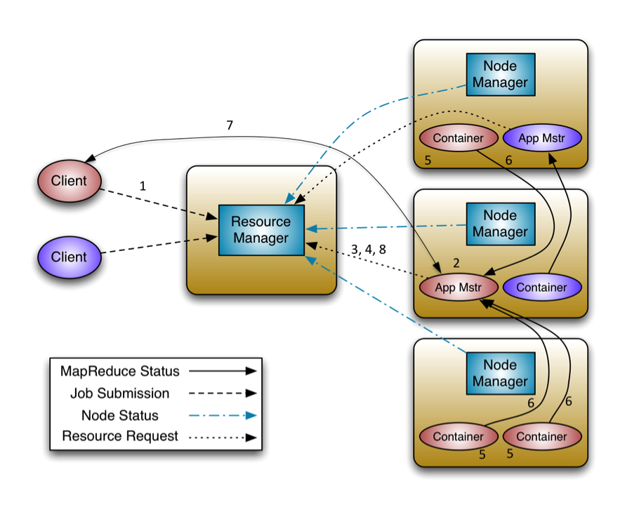

### 术语解释

yarn在大数据中所处的位置可以用下图来描述：

* application：就是平时我们常说的job。
* Container: yarn对计算机的计算资源的抽象，其实就是一组cpu和内存资源，未来可能会加入磁盘和网络资源，所有的应用都会运行在container中。
* ApplicationMaster：yarn中某个应用的抽象，就是应用的实例，是应用级别的,主要功能就是想ResourceManager申请计算资源(containers)，并且和NodeManager交互来执行和监控具体的task。

### ResourceManager

ResourceManager主要有两个组件：Scheduler和ApplicationManager。

#### Scheduler

Scheduler是一个资源调度器，它主要负责协调集群中各个应用的资源分配，保障整个集群的运行效率。Scheduler的角色是一个纯调度器，它只负责调度Containers，不会关心应用程序监控及其运行状态等信息。同样，它也不能重启因应用失败或者硬件错误而运行失败的任务。

Scheduler是一个可插拔的插件，它可以调度集群中的各种队列、应用等。在Hadoop的MapReduce框架中主要有两种Scheduler：Capacity Scheduler和Fair Scheduler。

#### ApplicationManager

ApplicationManager主要负责接收job的提交请求，为应用分配第一个Container来运行ApplicationMaster，还有就是负责监控ApplicationMaster，在遇到失败时重启ApplicationMaster运行的Container。

### NodeManager

NodeManager进程运行在集群中的节点上，每个节点都会有自己的NodeManager。NodeManager是一个slave服务：它负责接收ResourceManager的资源分配请求，分配具体的Container给应用。同时，它还负责监控并报告Container使用信息给ResourceManager。通过和ResourceManager配合，NodeManager负责整个Hadoop集群中的资源分配工作。ResourceManager是一个全局的进程，而NodeManager只是每个节点上的进程，管理这个节点上的资源分配和监控运行节点的健康状态。下面是NodeManager的具体任务列表：

* 接收ResourceManager的请求，分配Container给应用的某个任务。
* 和ResourceManager交换信息以确保整个集群平稳运行。ResourceManager就是通过收集每个NodeManager的报告信息来追踪整个集群健康状态的，而NodeManager负责监控自身的健康状态。
* 管理每个Container的生命周期。
* 执行Yarn上面应用的一些额外的服务，比如MapReduce的shuffle过程。

当一个节点启动时，它会向ResourceManager进行注册并告知ResourceManager自己有多少资源可用。在运行期，通过NodeManager和ResourceManager协同工作，这些信息会不断被更新并保障整个集群发挥出最佳状态。

NodeManager只负责管理自身的Container，它并不知道运行在它上面应用的信息。负责管理应用信息的组件是ApplicationMaster。

### Application Master

ApplicationMaster的主要作用是向ResourceManager申请资源并和NodeManager协同工作来运行应用的各个任务然后跟踪它们状态及监控各个任务的执行，遇到失败的任务还负责重启它。

资源的调度分配由ResourceManager专门进行管理，而每个job或应用的管理、监控交由相应的分布在集群中的ApplicationMaster，如果某个ApplicationMaster失败，ResourceManager还可以重启它，这大大提高了集群的拓展性。

关于Job或应用的管理都是由ApplicationMaster进程负责的，Yarn允许我们自己开发ApplicationMaster，我们可以为自己的应用开发自己的ApplicationMaster。这样每一个类型的应用都会对应一个ApplicationMaster，一个ApplicationMaster其实就是一个类库。这里要区分ApplicationMaster*类库和ApplicationMaster实例*，一个ApplicationMaster类库何以对应多个实例，就行java语言中的类和类的实例关系一样。总结来说就是，每种类型的应用都会对应着一个ApplicationMaster，每个类型的应用都可以启动多个ApplicationMaster实例。所以，在yarn中，是每个job都会对应一个ApplicationMaster而不是每类。

### container

Container是Yarn框架的计算单元，是具体执行应用task（如map task、reduce task）的基本单位。Container和集群节点的关系是：一个节点会运行多个Container，但一个Container不会跨节点。

一个Container就是一组分配的系统资源，现阶段只包含两种系统资源:cpu cores和memory(之后可能会增加磁盘、网络等资源)。

既然一个Container指的是具体节点上的计算资源，这就意味着Container中必定含有计算资源的位置信息：计算资源位于哪个机架的哪台机器上。所以我们在请求某个Container时，其实是向某台机器发起的请求，请求的是这台机器上的CPU和内存资源。

任何一个job或application必须运行在一个或多个Container中，在Yarn框架中，ResourceManager只负责告诉ApplicationMaster哪些Containers可以用，ApplicationMaster还需要去找NodeManager请求分配具体的Container。

### 应用提交过程分析

了解了上面介绍的这些概念，我们有必要看一下Application在Yarn中的执行过程，整个执行过程可以总结为三步：

* 应用程序提交。
* 启动应用的ApplicationMaster实例。
* ApplicationMaster实例管理应用程序的执行。

下面这幅图展示了应用程序的整个执行过程：

1、客户端程序向ResourceManager提交应用并请求一个ApplicationMaster实例。

2、ResourceManager找到可以运行一个Container的NodeManager，并在这个Container中启动ApplicationMaster实例。

3、ApplicationMaster向ResourceManager进行注册，注册之后客户端就可以查询ResourceManager获得自己ApplicationMaster的详细信息，以后就可以和自己的ApplicationMaster直接交互了。

4、在平常的操作过程中，ApplicationMaster根据resource-request协议向ResourceManager发送resource-request请求。

5、当Container被成功分配之后，ApplicationMaster通过向NodeManager发送container-launch-specification信息来启动Container， container-launch-specification信息包含了能够让Container和ApplicationMaster交流所需要的资料。

6、应用程序的代码在启动的Container中运行，并把运行的进度、状态等信息通过application-specific协议发送给ApplicationMaster。

7、在应用程序运行期间，提交应用的客户端主动和ApplicationMaster交流获得应用的运行状态、进度更新等信息，交流的协议也是application-specific协议。

8、一但应用程序执行完成并且所有相关工作也已经完成，ApplicationMaster向ResourceManager取消注册然后关闭，用到所有的Container也归还给系统。
