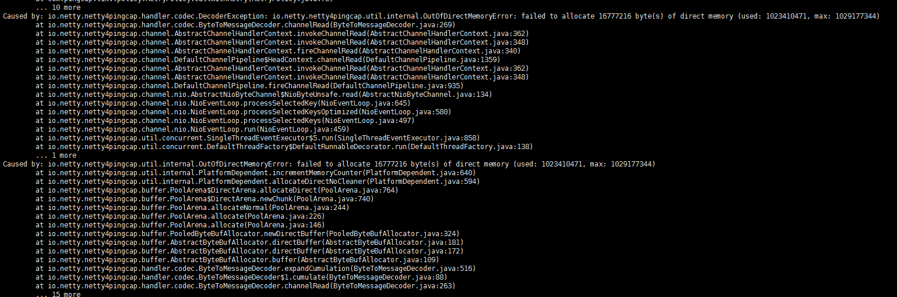

### tidb问题列表

* tikv服务概率起不来，并且无任何日志。

* 3亿数据的大部分的tidb检索语句有可能会报：[Err] 9005 - Region is unavaiable[try again later]，几乎不可用。

* pd-server报错：[error] campaign leader err github.com/pingcap/pd/server/leader.go:269: server closed下线，导致tidb连接不上pd-server，也下线，整个集群不可用。

* pd-server报警： Got signal [1] to exit。 Got signal [2] to exit。 Got signal [15] to exit,目前这个问题应该是不影响的。

* tidb用机械硬盘，打数据大概2分钟100万，但是后台有日志：IO wait, 16 minutes，说明磁盘撑不住这个性能。

* pd-server启动报错:fatal error: runtime: cannot allocate memory，导致pd-server下线。

* tispark必须用java8。

* tidb检索不稳定，特别是边打数据边检索。

* tidb官方提供的打数据工具syncer只支持mysql到tidb。

* tispark执行这个语句：spark.sql("select * from bms_vehicle_pass limit 10").write.format("orc").save("/home/cds/test3")报内存不够。

* 可以通过调节set tidb_distsql_scan_concurrency = n这个参数来提高检索性能，但是目前用了效果一般。

### greenplum问题列表

* 写入速度随着机器的增多会下降，目前每秒500条，比tidb慢。不过gpfdist目前还没有用。

* greenplum的查询语句如果有可能超过内存的话，会报错：Canceling query because of high VMEM usage. Used: 7375MB, available 814MB, red zone: 7372MB。拒绝了查询语句保证了服务的正常运行。不过可以修改/home/gpadmin/gpdata/gpmaster/gpseg-1/postgresql.conf下的gp_vmem_protect_limit参数调整内存大小。

* gp的master挂掉后，对外提供的ip会变，这个需要通过虚ip解决。
